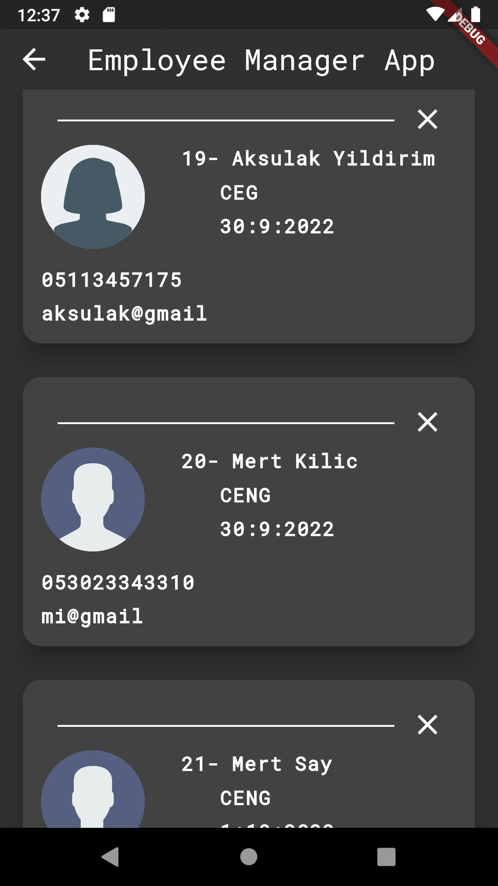

# SQFlite Database

 Package -> https://pub.dev/packages/flutter_signin_button

- supports both ios and Android
- includes add, delete, update and etc sql methods
- pure sql can be written

## Packages
- Sqflite -> https://pub.dev/packages/sqflite
- Path provider -> https://pub.dev/packages/path_provider

## Screeenshots
| Main Screen | Show Employees Screen | Add Employee Screen |
| ----------- | --------------------- | ------------------- |
| | |  |

| Update Screen | Update Information Screen |
| ----------- | --------------------- | 
| | |

| Delete Employee Screen | Delete Employee Screen-2 | Delete Employee Screen-3 |
| ----------- | --------------------- |---------------------|
| | |  

